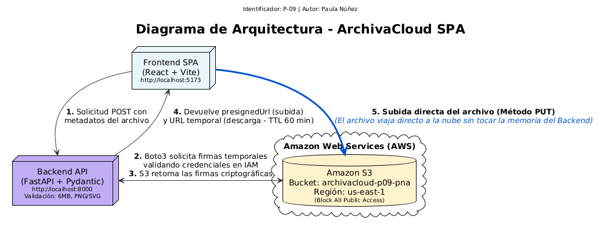

# ArchivaCloud SPA - Portal Web de Autoservicio

**Identificador asignado:** P-09  
**Alumna:** Paula Núñez Araneda  
**Fecha:** 02/07/2026

---

## 1. Parámetros únicos (Anexo B)

| Parámetro | Valor |
|-----------|-------|
| Pareja | P-09 |
| Tipos de archivo permitidos | PNG, SVG |
| Tamaño máximo | 6 MB |
| Bucket S3 | `archivacloud-p09-pna` |
| Región | `us-east-1` |
| Feature extra obligatoria | Generar un enlace temporal de descarga (Presigned URL con TTL de 60 minutos) en lugar de una URL pública |

> **Nota:**  
> El nombre `archivacloud-p09` ya se encontraba en uso en Amazon S3, por lo que se utilizó el nombre `archivacloud-p09-pna`.

---

## 2. Arquitectura del sistema

El sistema implementa un patrón basado en **Presigned URLs**, permitiendo desacoplar el backend de la transferencia de archivos.

El flujo de funcionamiento es el siguiente:

1. El navegador solicita al backend una URL firmada.
2. FastAPI valida la solicitud y genera la Presigned URL.
3. El navegador carga el archivo directamente en Amazon S3 utilizando esa URL.

De esta forma, el backend únicamente gestiona la autenticación y autorización, mientras que la transferencia del archivo se realiza directamente entre el cliente y Amazon S3.



---

## 3. Stack tecnológico

### Backend

- Python 3
- FastAPI 
- Boto3 
- Pydantic

### Frontend

- React 18
- Vite
- Axios

### Infraestructura

- Amazon S3

---

## 4. Variables de entorno y secretos

El proyecto utiliza un script de PowerShell (`setup-session.ps1`) para cargar credenciales temporales de AWS en la sesión de la terminal. De esta manera, el archivo `.env` no contiene credenciales sensibles, cumpliendo con el requisito **SEC-01**.

| Variable | Descripción | Ejemplo |
|-----------|-------------|----------|
| `AWS_REGION` | Región donde se encuentra el bucket | `us-east-1` |
| `S3_BUCKET_NAME` | Nombre del bucket | `archivacloud-p09-pna` |
| `PRESIGNED_URL_TTL` | Tiempo de expiración de la Presigned URL (segundos) | `3600` |
| `ALLOWED_EXTENSIONS` | Extensiones permitidas | `["png","svg"]` |
| `MAX_FILE_SIZE_MB` | Tamaño máximo permitido | `6` |
| `CORS_ALLOWED_ORIGINS` | Origen autorizado del frontend | `["http://localhost:5173"]` |

---

## 5. Políticas y permisos de AWS

### Política IAM de mínimo privilegio

```json
{
  "Version": "2012-10-17",
  "Statement": [
    {
      "Sid": "ArchivaCloudP09MinimoPrivilegio",
      "Effect": "Allow",
      "Action": [
        "s3:PutObject",
        "s3:GetObject",
        "s3:DeleteObject",
        "s3:ListBucket"
      ],
      "Resource": [
        "arn:aws:s3:::archivacloud-p09-pna",
        "arn:aws:s3:::archivacloud-p09-pna/uploads/*"
      ]
    }
  ]
}
```

### Configuración CORS del bucket

```json
[
  {
    "AllowedHeaders": ["*"],
    "AllowedMethods": ["GET", "PUT", "DELETE"],
    "AllowedOrigins": ["http://localhost:5173"],
    "ExposeHeaders": ["ETag"],
    "MaxAgeSeconds": 3600
  }
]
```

---

## 6. Ejecución del proyecto

### Backend

```bash
cd backend

# Cargar credenciales temporales de AWS
./setup-session.ps1

# Instalar dependencias
pip install -r requirements.txt

# Ejecutar la aplicación
uvicorn app.main:app --reload
```

Como alternativa, puede ejecutarse:

```bash
python run.py
```

> **Nota:** `run.py` fue configurado únicamente para facilitar la ejecución del proyecto durante el desarrollo.

### Frontend

```bash
cd frontend

npm install
npm run dev
```

---

## 7. Reporte de vulnerabilidades

### Backend

Se ejecutó:

```bash
pip-audit -r requirements.txt
```

Inicialmente se detectó una vulnerabilidad en `pydantic-settings` versión **2.14.1**, la cual fue corregida actualizando a la versión **2.14.2**.

**Resultado final:**

```text
No vulnerabilities found.
```

### Frontend

Se ejecutó:

```bash
npm audit
```

El análisis no detectó vulnerabilidades críticas ni de alta severidad en las dependencias del proyecto, por lo que no fue necesario ejecutar `npm audit fix`.

---

## 8. Descripción de la feature extra (P-09)

El bucket de Amazon S3 mantiene habilitada la opción **Block All Public Access**, por lo que los archivos almacenados no son accesibles mediante URLs públicas.

Cuando un usuario solicita descargar un archivo, la aplicación genera dinámicamente una **Presigned URL** utilizando Boto3. Esta URL posee un tiempo de expiración configurado mediante el parámetro `ExpiresIn`, cuyo valor corresponde a **3600 segundos (60 minutos)**.

Una vez transcurrido ese período, la URL deja de ser válida automáticamente, permitiendo un acceso temporal y controlado a los archivos almacenados.

## 9. Github

[Enlace a Repositorio](https://github.com/paununeza/archivacloud-p09/commits/main/)